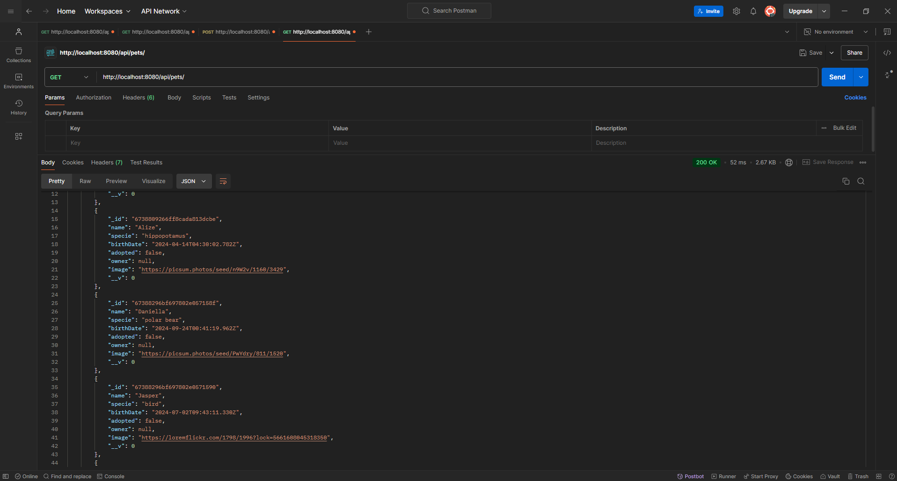
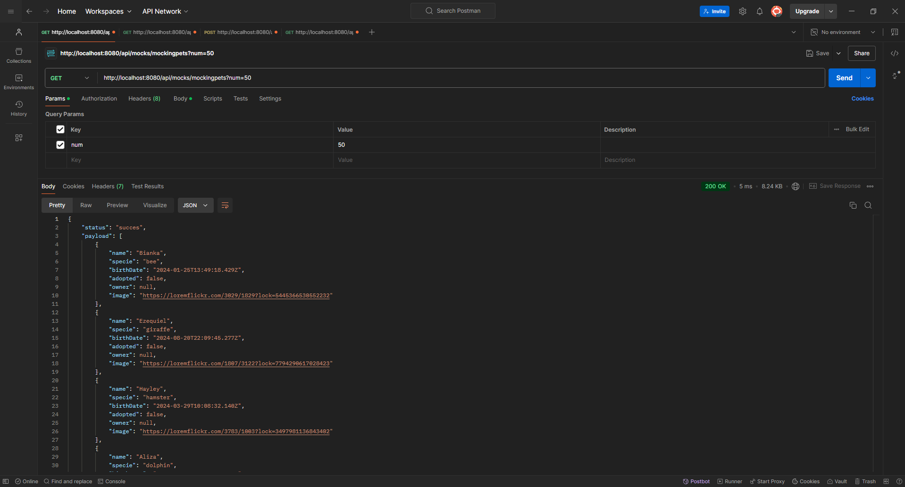
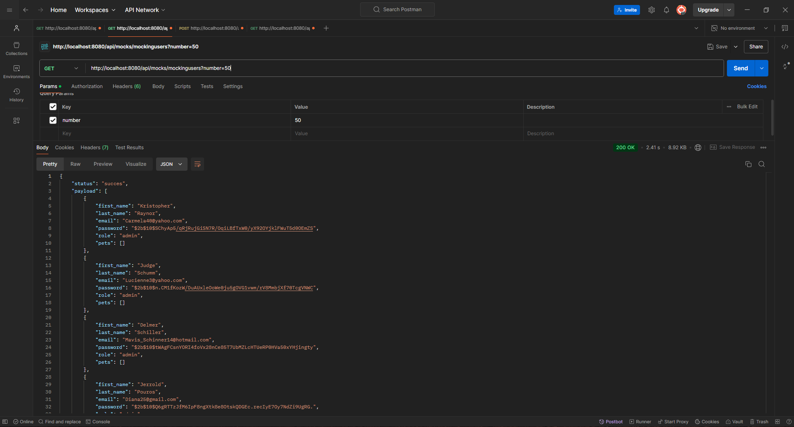
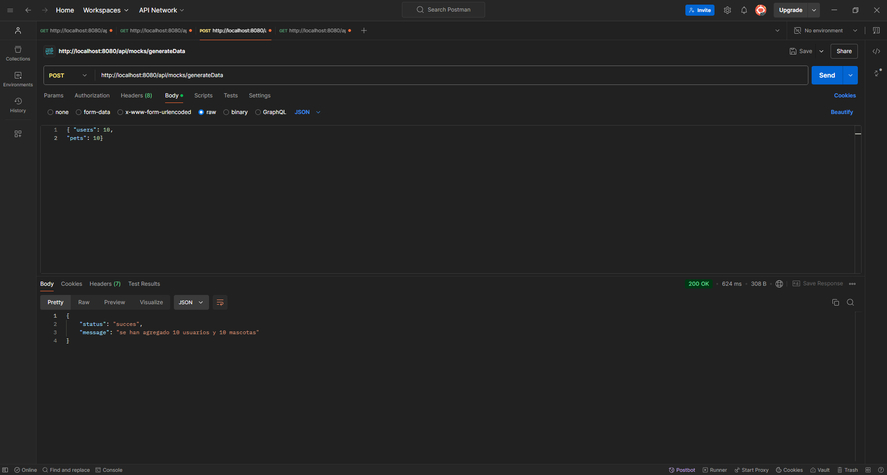
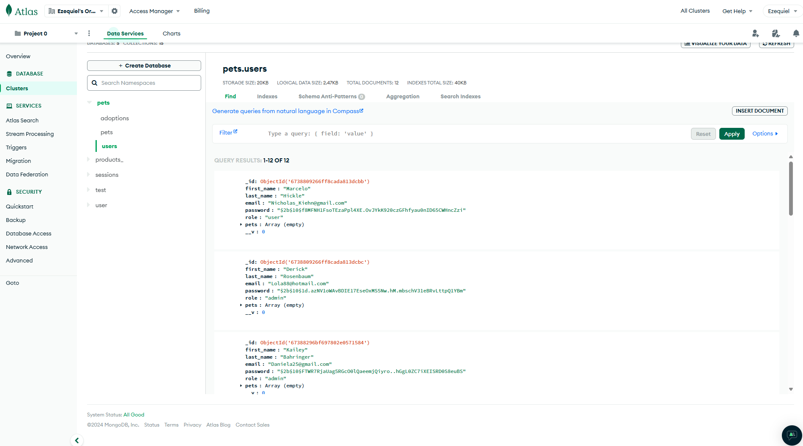
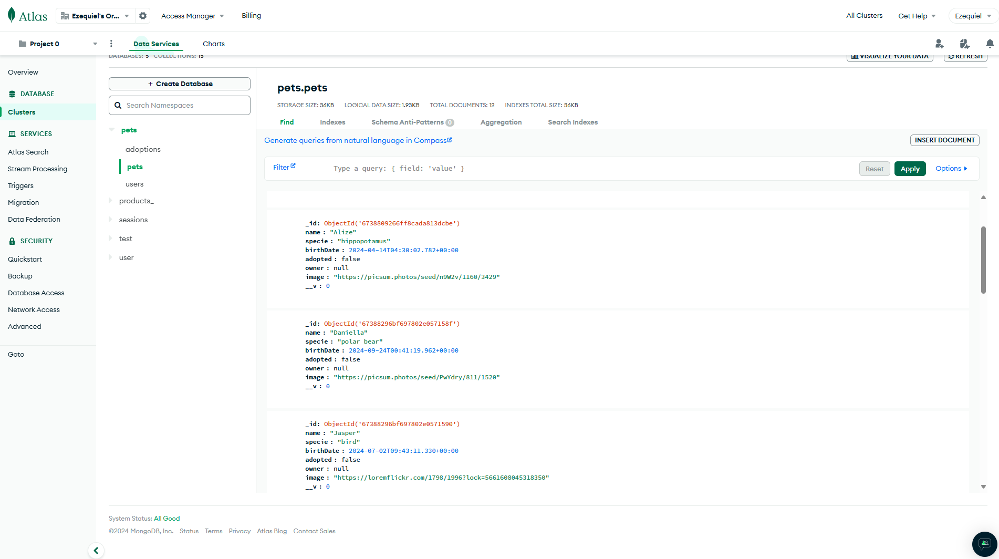
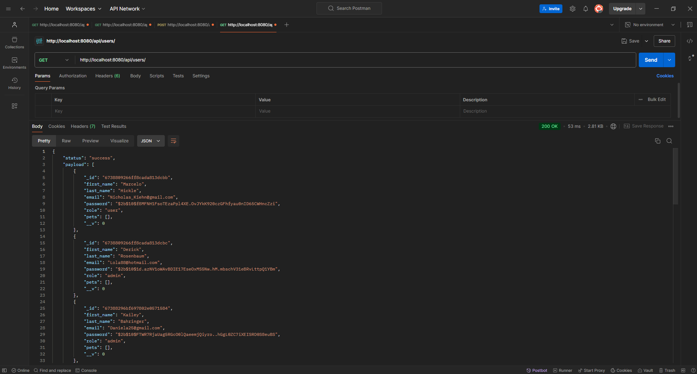
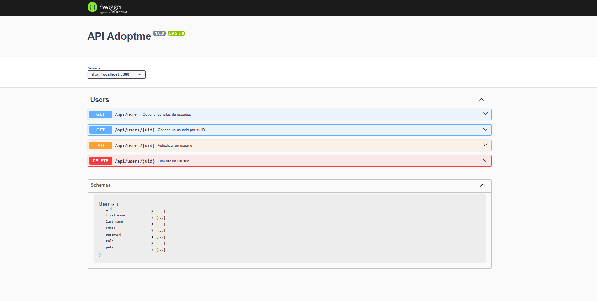
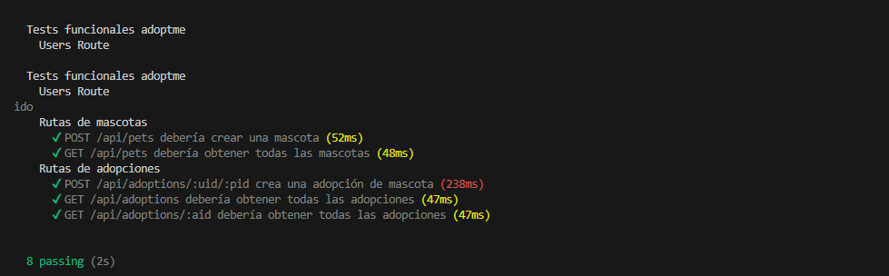

# Backend 3°Parte - Proyecto Final - Cordoba Ezequiel

El proyecto que se presenta simula ser una página gestionadora de mascotas, relacionando cada mascota con su dueño. La finalidad del proyecto es demostrar los conocimientos de Backend que se tienen y se adquirieron en el curso de Programación Backend III: Testing y Escalabilidad Backend de CODERHOUSE, con el profesor Omar Jesús Maniás. 


## Apéndice
1. [Instalación](#Instalación)
2. [Servidor](#Servidor)
3. [Rutas](#Rutas)
4. [Endpoints](#Endpoints)
5. [Autenticacion y autorización](#Autenticacion)
6. [Swagge](#Swagger)
7. [Estructura del Proyecto](#estructura)
8. [Testeo](#Testeo)
9. [Recursos utilizados](#Recursos)

## Instalación
### Requisitos previos
- Node.js v14.17.0
### Instrucciones de instalación
Para clonar el repositorio:

```bash
git clone https://github.com/Ezecordoba14/Preentrega-CordobaBKNIII.git
```
Instalar las dependencias
```bash
npm install
```
Iniciar la aplicación
```bash
npm start
```

## Servidor
El servidor está configurado para ejecutarse en localhost en el puerto 8080. Una vez que la aplicación esté inicializada con el comando npm start, se puede visualizar el proyecto en un navegador con el siguiente link:

http://localhost:8080/
## Rutas
Esta aplicacion utiliza cuatros rutas para funcionar:
- Products: Contiene los métodos GET, POST, PUT y DELETE para la gestión de productos.
- Carts: Incluye los métodos GET, POST, PUT y DELETE para la gestión de carritos.
- Sessions: Permite el registro, inicio de sesión y autentificación del usuario dentro del sitio. Incluye los métodos GET y POST.
- Views: Permite renderizar la información en pantalla usando Handlebars mediante el método GET.

- Adoption: Contiene los métodos GET y POST para la gestión de las adopciones de las mascotas.
- Mocks: Contiene los métodos GET y POST para traer y generar información simulada de usuarios y mascotas.
- Pets: Contiene los métodos GET, POST, PUT y DELETE para la gestión de mascotas.
- Sessions: Permite el registro, inicio de sesión y autentificación de usuarios dentro del sitio. Incluye los métodos GET y POST.
- Users: Contiene los métodos GET, POST, PUT y DELETE para la gestión de mascotas.
## Endpoints
### Pets
- GET: El endpoint trae el listado completo de las mascotas con todo sus detalles.
    - Demostración en postman: (se adjuntan imagenes del proceso)
    1. Traer información de las mascotas GET http://localhost:8080/api/pets
    

- POST: El endpoint permite agregar una nueva mascota. El id del nuevo producto se define solo, de manera que no se repita con ninguno de los anteriores por medio de mongoDB.
    - Tambien permite actulizar la imagen representativa de la mascota mediante /api/pets/withimage

- PUT: Este endpoint permite modificar cualquiera de las mascotas que se encuentran en la base de datos especificando el id del mismo mediante /api/pets/:pid. El método buscará los datos a cambiar y solo cambiará los mismos, sin necesidad de volver a escribir todo el detalle de la mascota.

- DELETE: El endpoint busca la mascota mediante la especificación del pid /api/pets/:pid, y elimina la mascota, actualizando la base de datos al hacerlo.

### Mocks
- GET:  El endpoint simular la información de los usuarios y las mascotas a través de los endpoints /api/mocks/mockinusers y /api/mocks/mockinpets respectivamente, ambos endpoints generarán por defecto la información de 50 personas o mascotas si no se les indica otro número.
    - Demostración en postman: (se adjuntan imagenes del proceso)
    1. Generar mascotas simuladas GET http://localhost:8080/api/mocks/mockingpets?num=50
    
    2. Generar usuarios simulados GET http://localhost:8080/api/mocks/mockingusers?num=50
    
    3. Insertar datos simulados en la base de datos (POST) 
        POST http://localhost:8080/api/mocks/generateDate
        En el cuerpo de la solicitud (Body), seleccionamos RAW y formato JSON:
        {
            "users": 10,
            "pets": 10
        }
    
    4. Corroborar en mongoDB:
    
    

- POST: El endpoint /api/mocks/generateDate realiza la acción de guardar en la base de dato la información simulada.


### Adoption
- GET:  Endpoint que nos da como resultado la información de todas las adopciones o la de una en específico a través de los endpoints /api/adoptions o /api/adoptions/:aid

- POST: Utilizado para crear y guardar en la base de dato la información de una adopción nueva.


### Users
- GET: El endpoint trae el listado completo de los usuarios con todo sus respectiva información.
    - Demostración en postman: (se adjuntan imagenes del proceso)
    1. Traer información de los usuarios GET http://localhost:8080/api/users
    


- PUT: Este endpoint permite modificar la información cualquier usuario que se encuentran en la base de datos especificando el id del mismo mediante /api/user/:uid.

- DELETE: El endpoint busca la mascota mediante la especificación del pid /api/users/:pid, y elimina el usuario de la base de datos.

### Sessions
- GET: El endpoint de GET de Sessions permite obtener los datos del usuario autenticado.

    - /current: Envía los datos del usuario logeado una vez que se autentica la sesión del mismo al frontend.

- POST: Los siguientes endpoints habilitan el registro, logueo y autentificación del usuario a través de inserciones en la base de datos y verificaciones en la misma.

    - /register: Permite el registro del usuario verificando que el correo electrónico no se encuentre ya en la base de datos. Una vez que se crea el registro, el usuario tendrá un rol de user podiendo crear los carritos que desee.

    - /login: Permite el inicio de sesión siempre que se haya registrado el usuario previamente, si el inicio de sesión es exitoso, se genera un token que se almacena en las cookies.


## Autenticacion

Se utiliza express-session para mantener la sesión en MongoStore. Adicionalmente se utiliza passport y JsonWebToken como estatregia de autenticación y autorización a lo largo de la navegación del sitio, teniendo como objetivo principal no autorizar ciertos accesos y proteger la sesión del usuario así como también sus datos sensibles. Se utiliza cookie-parser para poder extraer los tokens generados en los inicios de sesión, y permite la navegación durante una hora sin cerrar la sesión de manera automática.
## Autenticación y autorización

Se utiliza express-session para mantener la sesión en MongoStore. Adicionalmente se utiliza passport y JsonWebToken como estatregia de autenticación y autorización a lo largo de la navegación del sitio, teniendo como objetivo principal no autorizar ciertos accesos y proteger la sesión del usuario así como también sus datos sensibles. Se utiliza cookie-parser para poder extraer los tokens generados en los inicios de sesión, y permite la navegación durante una hora sin cerrar la sesión de manera automática.
## Swagger
Para ver la documentación de los endpoints users, abrir en el navegador:
```bash
http://localhost:8080/api-docs
```

## Estructura
```
src
 ┣ config
 ┃ ┗ dotenv.config.js
 ┣ controllers
 ┃ ┣ adoptions.controller.js
 ┃ ┣ pets.controller.js
 ┃ ┣ sessions.controller.js
 ┃ ┗ users.controller.js
 ┣ dao
 ┃ ┣ models
 ┃ ┃ ┣ Adoption.js
 ┃ ┃ ┣ Pet.js
 ┃ ┃ ┗ User.js
 ┃ ┣ Adoption.js
 ┃ ┣ Pets.dao.js
 ┃ ┗ Users.dao.js
 ┣ dto
 ┃ ┣ Pet.dto.js
 ┃ ┗ User.dto.js
 ┣ mocks
 ┃ ┗ mocking.js
 ┣ public
 ┃ ┗ img
 ┃ ┃ ┣ 1671549990926-coderDog.jpg
 ┃ ┃ ┣ generateData.png
 ┃ ┃ ┣ getPets.png
 ┃ ┃ ┣ getUsers.png
 ┃ ┃ ┣ mockingPets.png
 ┃ ┃ ┣ mockingUsers.png
 ┃ ┃ ┣ petsMongo.png
 ┃ ┃ ┣ swagger.png
 ┃ ┃ ┣ test.png
 ┃ ┃ ┗ usersMongo.png
 ┣ repository
 ┃ ┣ AdoptionRepository.js
 ┃ ┣ GenericRepository.js
 ┃ ┣ PetRepository.js
 ┃ ┗ UserRepository.js
 ┣ routes
 ┃ ┣ adoption.router.js
 ┃ ┣ mocks.router.js
 ┃ ┣ pets.router.js
 ┃ ┣ sessions.router.js
 ┃ ┗ users.router.js
 ┣ services
 ┃ ┗ index.js
 ┣ test
 ┃ ┗ supertest.test.js
 ┣ utils
 ┃ ┣ index.js
 ┃ ┣ swagger.js
 ┃ ┗ uploader.js
 ┗ app.js
```
## Testeo
Este comando ejecuta los tests funcionales definidos en el archivo `src/test/supertest.test.js`
El siguiente comando permitira ejecutar el testeo
```bash
npm test
```
Obteniendo las siguientes pruebas

## Recursos
- @faker-js/faker: utilizado para generar datos realistas y no datos falsos obvios.
`Versión`: ^9.2.0
- Bcrypt: Biblioteca para el hash y la verificación de contraseñas.
`Versión`: ^5.1.1
- Cookie-Parser: Middleware para analizar cookies en las solicitudes HTTP.
`Versión`: ^1.4.6
- Dotenv: Carga variables de entorno desde un archivo .env.
`Versión`: ^16.4.5
- Express: Un marco web para Node.js, utilizado para construir el backend.
`Versión`: ^4.19.2
- Jsonwebtoken: Biblioteca para trabajar con JSON Web Tokens (JWT).
`Versión`: ^9.0.2
- Mongoose: Biblioteca para la modelación de datos en MongoDB y la interacción con la base de datos.
`Versión`: ^8.5.1
- Multer: Middleware para el manejo de 'datos multiparte/formularios'.
`Versión`: ^1.4.5-lts.1
- Supertest: proporcionar una abstracción de alto nivel para las pruebas HTTP, al tiempo que le permite bajar a la API de nivel inferior proporcionada por superagent.
`Versión`: ^6.3.3
- Swagger-jsdoc: Esta biblioteca lee el código fuente anotado por JSDoc y genera una especificación OpenAPI.
`Versión`: ^6.2.8
- Swagger-ui-express: Este módulo le permite servir documentos de API generados automáticamente por swagger-ui desde express, basados en un archivo.
`Versión`: ^5.0.1
